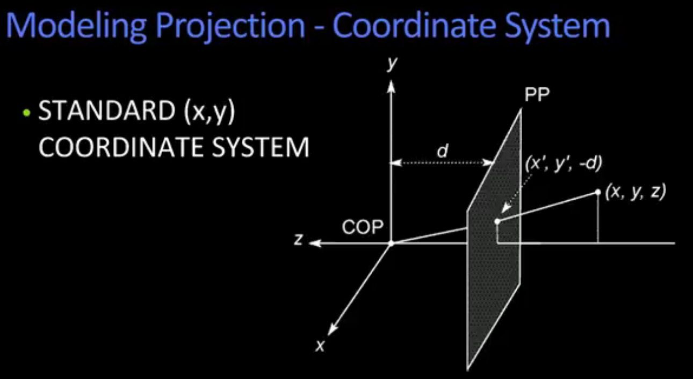

## Stereo Vision Notes
This serves to document some of my study of computer vision. Meant to be used as a reference for myself but others may find it useful. I am only highlighting areas for my own learning and so it is not comprehensive and skips over a lot of required background that I already have. Below figures and text are taken from multiple sources listed below.

[figure1]: ./projection_coordinate_system_big.png
[figure1a]: ./Perspective_Projection.png
[Rigid Transformation]: ./Rigid_Transformation.png
[Rigid Transformation Homgenous]: ./Rigid_Transformation_Homogenous.png
[Rotation Matrix R]: ./Rotation_Matrix_R.png
[figure2]: ./Stereo_geometry_depth.png

[basic w/o depth in Matlab-mccormick](http://mccormickml.com/2014/01/10/stereo-vision-tutorial-part-i/)

[Udacity Intro to Computer Vision-ud810](https://www.udacity.com/course/introduction-to-computer-vision--ud810)

### Perspective Projection
To describe projection conveniently in math terms, we place the center of projection at the origin and put the image plane in front of it to avoid dealing with the fact that a real camera inverts the image. This also means that y direction is positive in up direction which is opposite of normal image processing.

![alt text][figure1]
Next figure shows how to use matrix formulation with homogeneous coordinates.
![alt text][figure1a]
Where $(u,v)$ represents the coordinates in the image of some point $(x,y,z)$ out in the world projected through a projection with focal length of $f$. So we convert to $(u,v)$ when we need to work with an image.

### Extrinsic and Intrinsic Parameter matrix
Extrinsic parameter matrix transforms from world view to camera view.
![alt text][Rigid Transformation]
Then using homogeneous coordinates
![alt text][Rigid Transformation Homgenous]
Examples of Rotation Matrx R:
![Rotation Matrix R]

#### Stereo system geometry for depth measurement
The geometry for co-planar images (taken from [Udacity Intro to Computer Vision-ud810](https://www.udacity.com/course/introduction-to-computer-vision--ud810) is shown here ![alt text][figure2]

The  term  $x_l-x_r$ is known as disparity.

#### Basic Idea of extracting depth from stereo images
The difference in horizontal position of the same object (feature) taken from two views is proportional to the depth of that object. Search for matching patches and calculate the distance.

#### Image Rectification
Image Rectification is process of insuring that the two stereo images have been transformed such that you only have to search horizontally by row to find matching patches.

1) Does this step introduce distortion? Guess is yes.

2) What is complexity cost of rectification vs full search?

#### Search Range and Direction
To reduce complexity, only search up to maximum expected disparity. General case of search direction is that you can have disparity of both positive and negative values if the stereo cameras are not aligned. If aligned, you can save time and search in only one direction.
